SCARA robot solving the puzzle of the Towers of Hanoi simulation in Matlab. 

  
  
    

## SCARA robot solving the puzzle of the Towers of Hanoi simulation in Matlab  

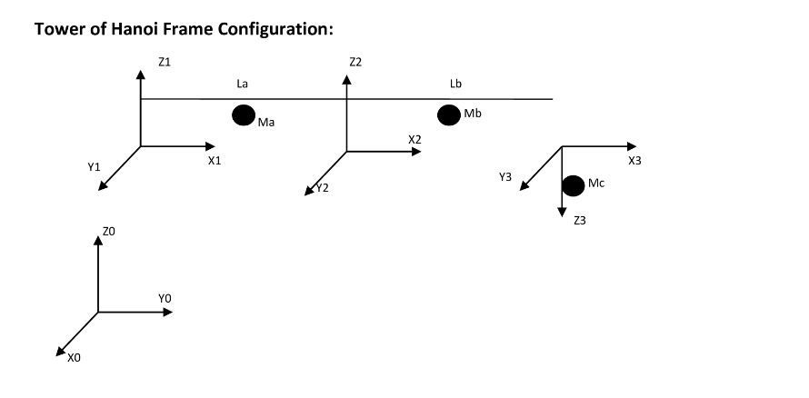
 

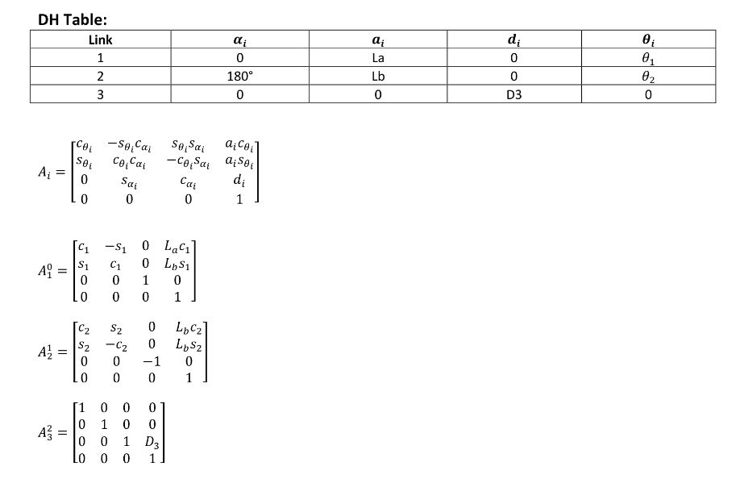
 

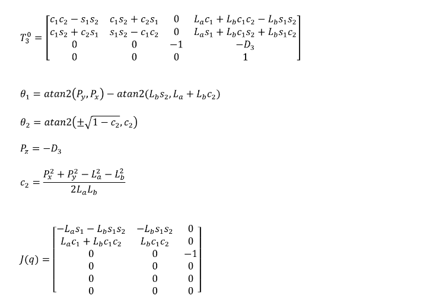
 

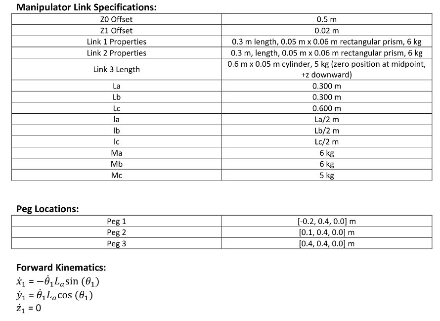
 

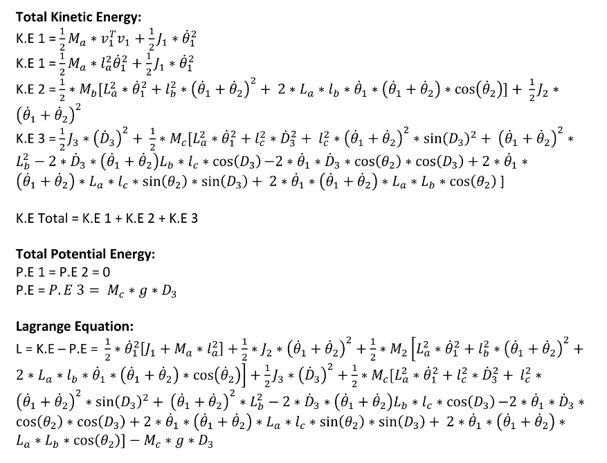
 

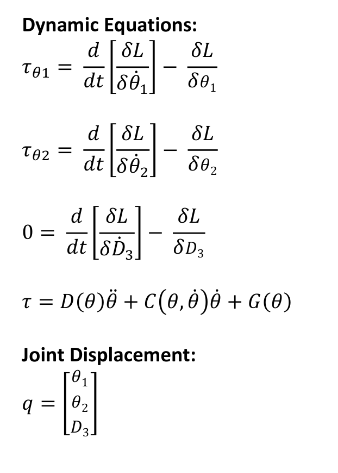
 

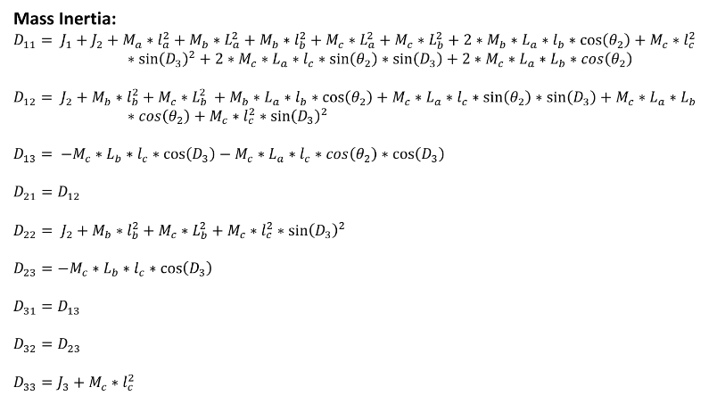
 

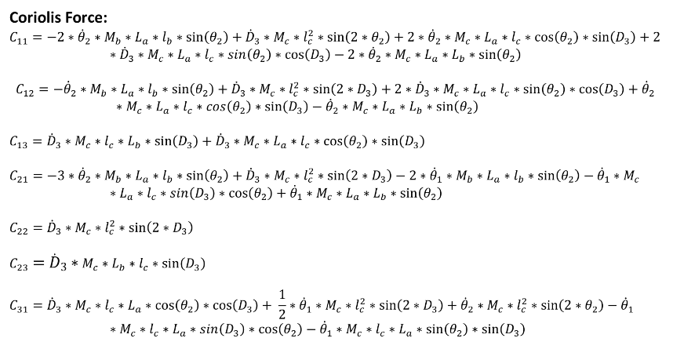
 

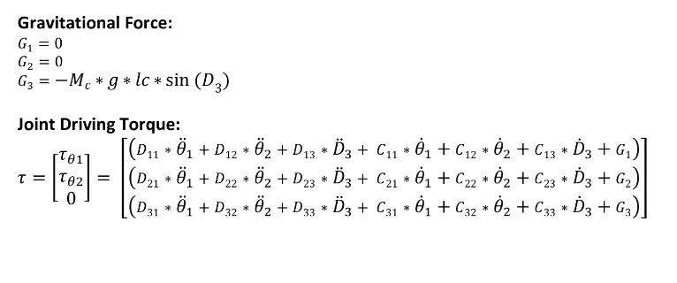
 

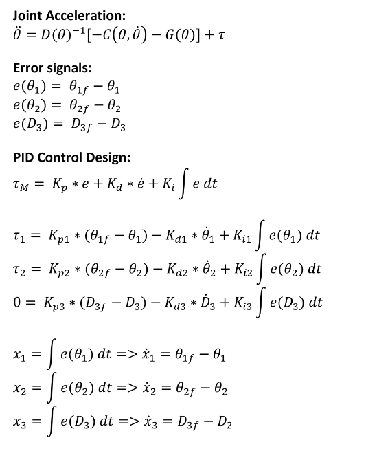
 

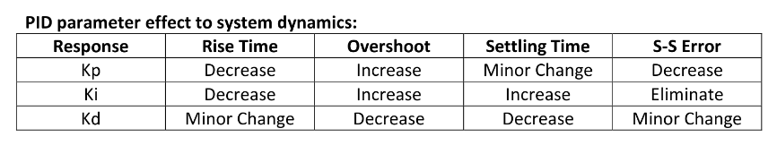
 

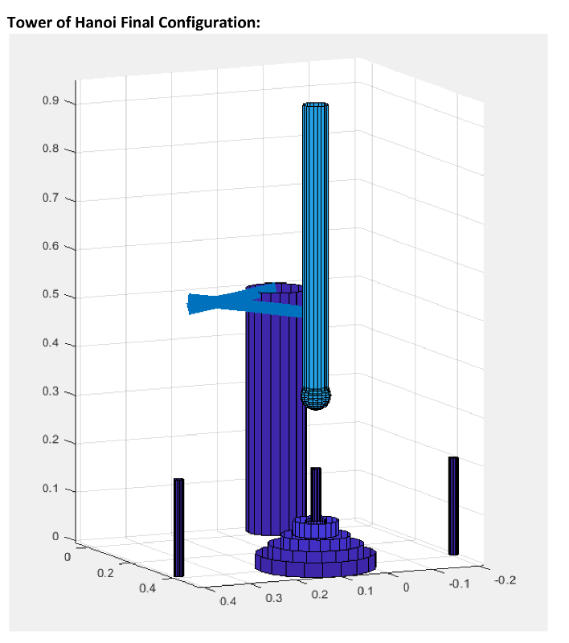
 

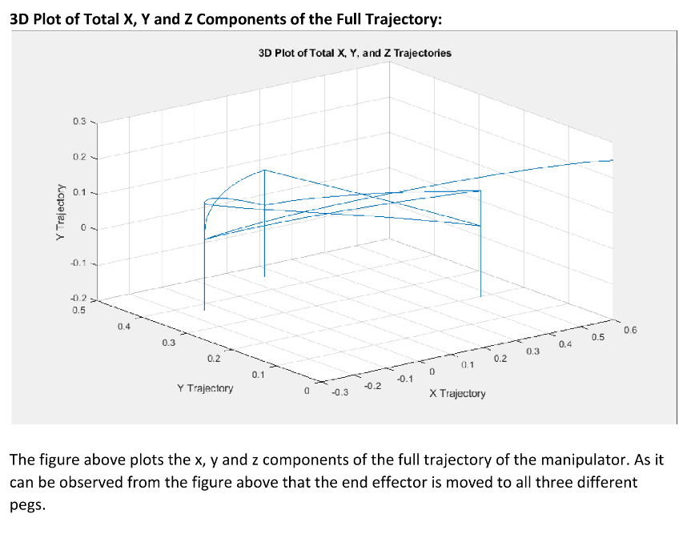
 

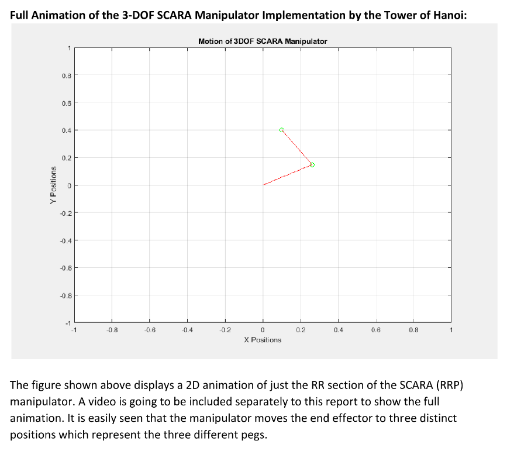
 

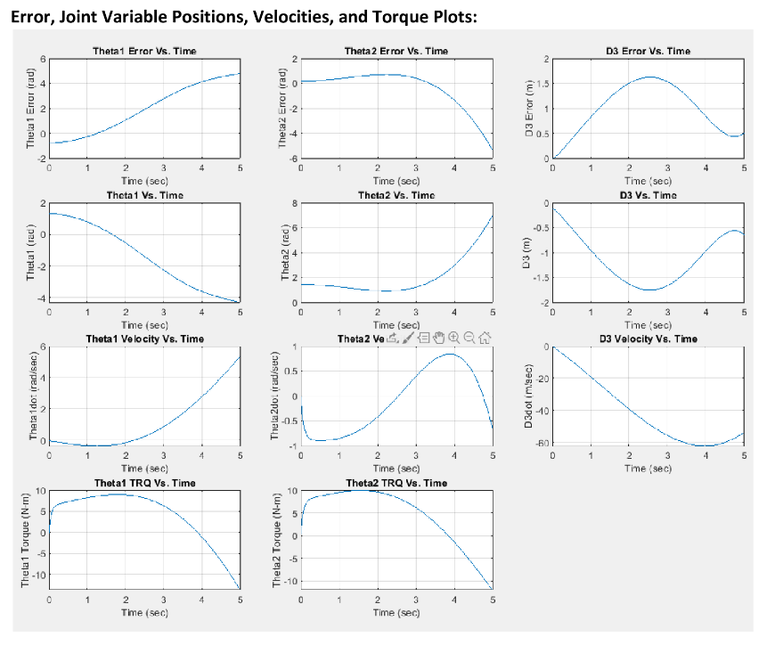
 

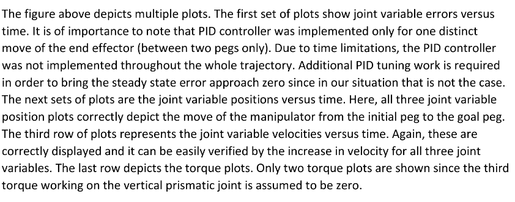
 

https://abedinsherifi.github.io/Tower_of_Hanoi/

